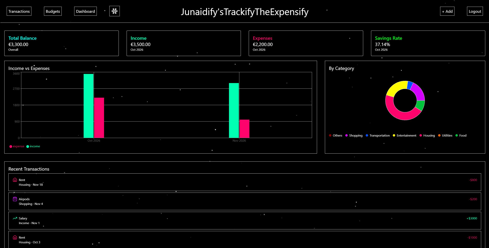
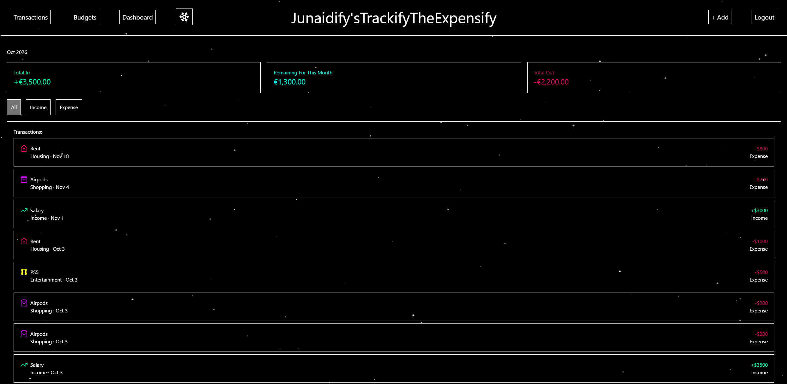
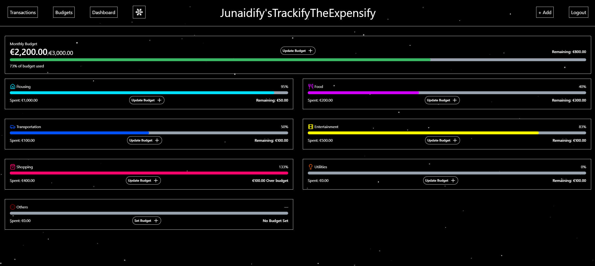
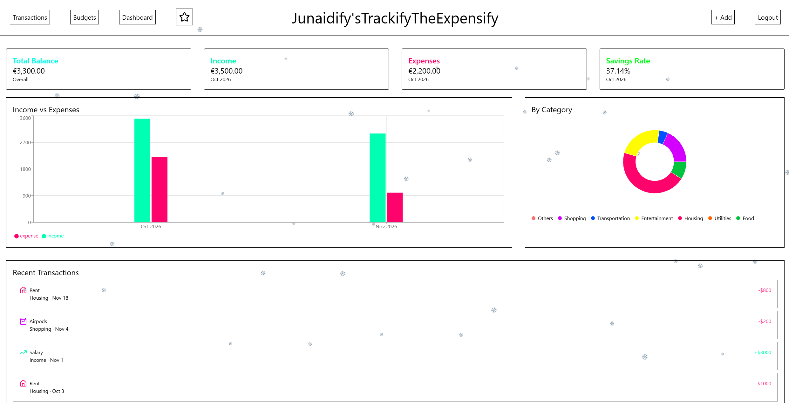

# TrackifyTheExpensify

TrackifyTheExpensify is a full-stack personal finance application for tracking income, expenses, and monthly budgets.

The application provides users with a personalized dashboard where they can monitor their finances, visualize income and spending patterns, manage category-based budgets, and review their transaction history.

## Live Demo

**Live Application:** https://trackify-the-expensify.vercel.app

## Screenshots

### Dashboard



### Transactions



### Budget Management



### Light Mode



## Features

- User registration, login, and logout
- Protected application routes
- User-specific transactions and budgets
- Add income and expense transactions
- Categorize transactions
- View recent transaction history
- Filter transactions by type
- Monthly income, expense, balance, and savings calculations
- Income vs. expense visualization by month
- Expense breakdown by category
- Monthly budget management
- Category-specific budgets
- Budget progress and remaining-budget calculations
- Responsive design for desktop and mobile devices
- Dark and light themes with animated backgrounds
- Demo page for exploring the application
- Unit tests for financial calculation logic

## Tech Stack

### Frontend

- Next.js
- React
- TypeScript
- Tailwind CSS
- Recharts
- Lucide React

### Backend & Database

- Next.js server-side functionality
- Prisma ORM
- PostgreSQL
- Neon

### Authentication

- Better Auth

### Testing

- Vitest

### Deployment

- Vercel
- Neon PostgreSQL

## Getting Started

### 1. Clone the repository

```bash
git clone https://github.com/junaidabdulazeez10-tech/TrackifyTheExpensify.git
```

Navigate into the application:

```bash
cd TrackifyTheExpensify/my-app
```

### 2. Install dependencies

```bash
npm install
```

### 3. Configure environment variables

Create a `.env` file inside the application directory.

Add the following environment variables:

```env
DATABASE_URL=
BETTER_AUTH_SECRET=
BETTER_AUTH_URL=http://localhost:3000
```

`DATABASE_URL` should contain your PostgreSQL connection string.

`BETTER_AUTH_SECRET` should contain a secure secret used by Better Auth.

Do not commit your `.env` file or credentials to the repository.

### 4. Generate the Prisma Client

```bash
npx prisma generate
```

### 5. Apply database migrations

```bash
npx prisma migrate dev
```

### 6. Start the development server

```bash
npm run dev
```

The application will be available at:

```text
http://localhost:3000
```

## Testing

The project includes unit tests for financial calculation logic.

Run the tests with:

```bash
npm test
```

For a single test run:

```bash
npm test -- --run
```

## Production Build

To create and verify a production build locally:

```bash
npm run build
```

## What I Learned

Building TrackifyTheExpensify gave me practical experience developing a full-stack application from database design through production deployment.

During the project, I worked with:

- Designing relational data models with Prisma and PostgreSQL
- Implementing authentication and protected routes
- Associating transactions and budgets with individual users
- Ensuring users can only access their own financial data
- Building reusable React components with TypeScript
- Aggregating transaction data to calculate financial metrics
- Transforming application data for charts and visualizations
- Building responsive layouts with Tailwind CSS
- Managing client-side and server-side responsibilities
- Writing unit tests for financial calculation logic
- Managing development and production environment variables
- Deploying a database-backed Next.js application to production

## Deployment

TrackifyTheExpensify is deployed on Vercel, with the PostgreSQL database hosted on Neon.

**Production:** https://trackify-the-expensify.vercel.app